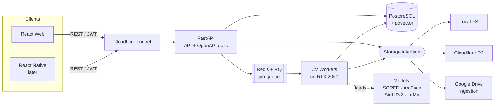
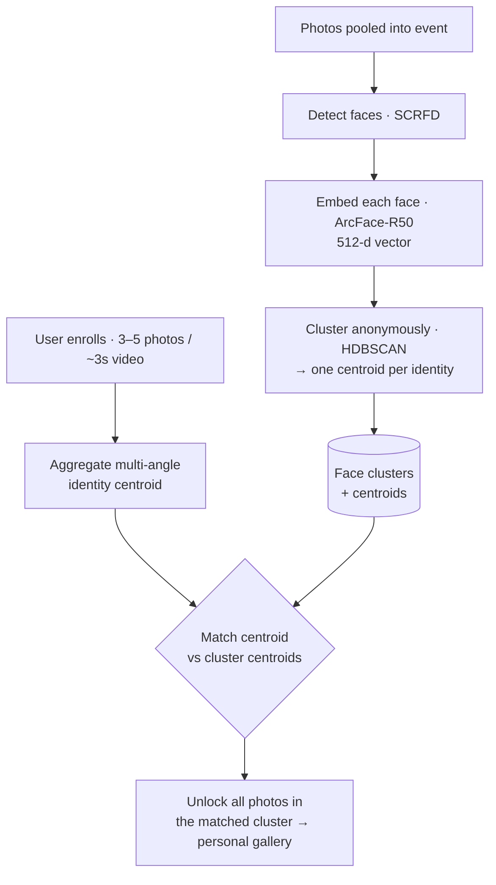

# La2etha! · لقيتها

**Found it!** — the exclamation of relief when you finally spot your photo.

*Pool everyone's photos from a gathering, and a custom computer-vision pipeline hands each person a
private gallery of only the shots they're actually in.*

---

## The problem

At any Egyptian *lamma* or *kherga*, the *shilla* shoots hundreds of photos across a dozen phones and
cameras. When the night ends, getting the right photos to the right people turns into the same tired
chore — scrolling your camera roll, cropping, and firing off *"send me the pics"* a hundred times.
Photos get lost, moments get missed, and nobody ends up with the full set.

**La2etha!** kills that chore. Everyone drops their photos into one shared event. After a quick face
enrollment, each person opens their own gallery and sees **only** the photos they appear in — nothing
else, and nothing of anyone else's.

## What makes it different

This is **not** a thin wrapper over a face-recognition API. It's a purpose-built pipeline engineered
to scale: instead of comparing every registered person against every discovered face (an
`O(people × faces)` explosion that melts a server), we **cluster all faces once at upload time**, then
match each person's identity against a handful of cluster centroids. One clustering pass, one match
per person — the rest is instant.

Access is identity-gated by design: you can only open a source photo you're genuinely in, or one you
own as the event host. Other people's photos are never readable.

## How it works

### The core engine — cluster once, match once

### A person's journey

## Tech stack

**Backend — [`la2etha-backend`](https://github.com/la2etha/la2etha-backend)**

| Area | Choice |
|------|--------|
| API | Python · FastAPI · auto-generated OpenAPI |
| Auth | FastAPI-Users (JWT + OAuth), self-hosted |
| Data + vectors | PostgreSQL + `pgvector` (one store) |
| Async | Redis + RQ workers |
| Face detection | SCRFD (InsightFace) |
| Face embedding | ArcFace-R50 |
| Clustering | HDBSCAN (benchmarked vs Chinese Whispers, DBSCAN) |
| Quality / proximity | Variance-of-Laplacian + blink + face-scale (Depth-Anything optional) |
| Semantic search | SigLIP-2 (multilingual — handles Arabic queries) |
| Privacy removal | LaMa (local inpainting) |
| AI editing (stretch) | Gemini "Nano Banana" (free tier, opt-in) |

**Frontend — [`la2etha-frontend`](https://github.com/la2etha/la2etha-frontend)**

| Area | Choice |
|------|--------|
| Web | React + TypeScript + Vite |
| Mobile (later) | React Native, reusing the same REST API |
| Hosting | Cloudflare Pages / Vercel → backend via Cloudflare Tunnel |

**Brand palette:** dark teal · soft cream · burnt orange.

## Repositories

- **[`la2etha-backend`](https://github.com/la2etha/la2etha-backend)** — FastAPI service + CV workers. Runs inference locally on a single RTX 2060.
- **[`la2etha-frontend`](https://github.com/la2etha/la2etha-frontend)** — React web app, growing into a React Native mobile app.

## Status

🚧 In active development — a Computer Vision capstone project. The graded centerpiece is the custom
recognition pipeline, evaluated on gallery recall/precision, clustering quality, and a single- vs
multi-angle enrollment ablation against public benchmarks.

## Privacy

Photos and face embeddings stay on our own machine. A person can only see photos they're verified in;
raw pools are never broadly readable. Embeddings and photos are deleted when an event is deleted, and
anyone can delete their own identity and gallery.
