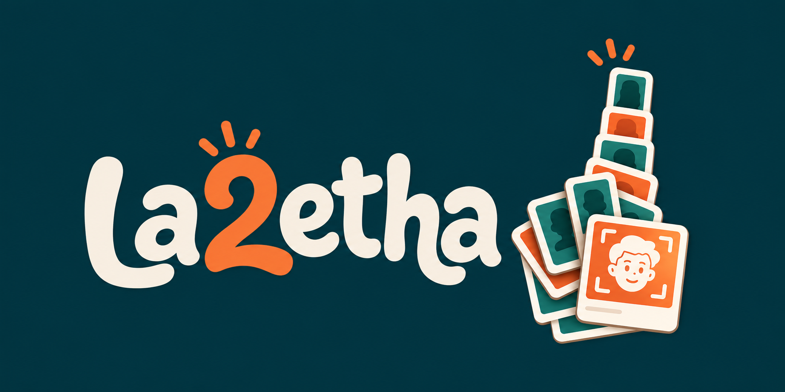
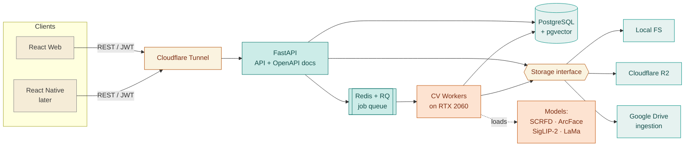
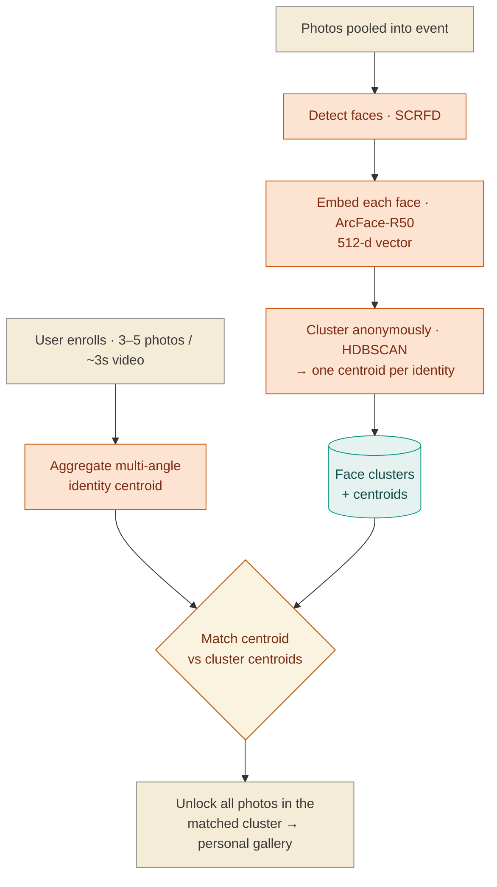
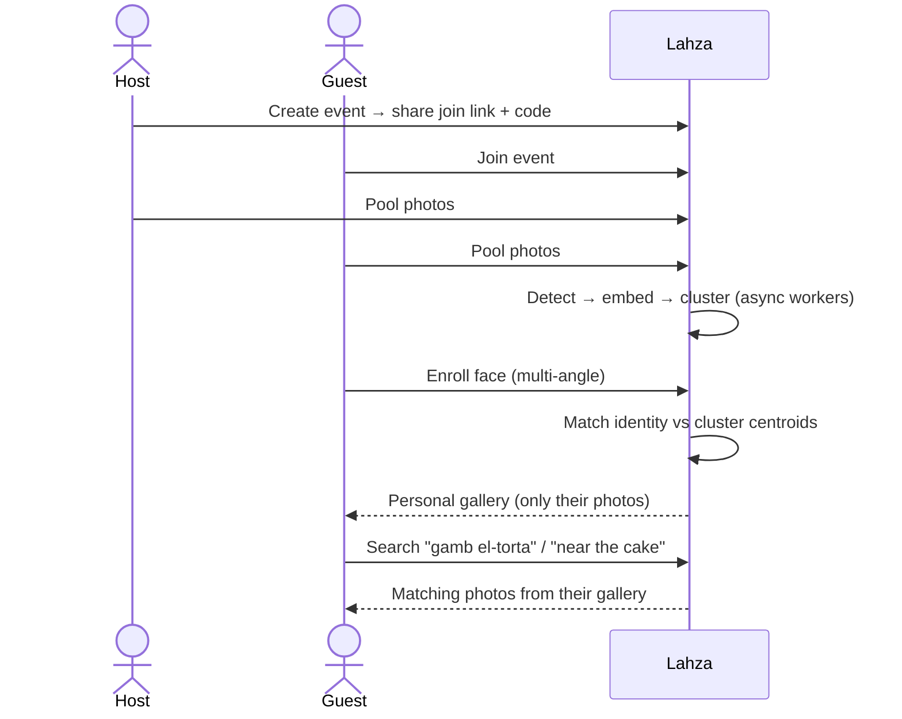

# Lahza · لحظة

**Moment** — because every moment deserves to find its people.

*Pool everyone's photos from a gathering, and a custom computer-vision pipeline hands each person a private gallery of only the shots they're actually in.*

[Problem](#-the-problem) · [What's different](#-what-makes-it-different) · [How it works](#-how-it-works) · [Core engine](#-the-core-engine--cluster-once-match-once) · [Tech stack](#-tech-stack) · [Repositories](#-repositories) · [Team](#-team)

---

> [!NOTE]
> **Privacy is the whole point.** Photos and face embeddings stay on our own machine. A person can only see photos they're verified in — raw pools are never broadly readable. Delete an event and its photos and embeddings go with it; anyone can delete their own identity and gallery at any time.

---

## 📦 Repositories

| Component | Repository | What's inside |
|-----------|------------|---------------|
| 🧠 CV Pipeline + FastAPI Backend | https://github.com/la2etha/la2etha-backend | Face detection, embedding, clustering, enrollment matching, quality culling, semantic search, privacy export, REST API + async workers |
| 💻 React Frontend | https://github.com/la2etha/la2etha-frontend | Conversational photo-sharing UI — create/join events, pool photos, enroll your face, browse your private gallery |

The backend runs the entire computer-vision pipeline locally on a single GPU. The frontend is a React web app (growing toward React Native mobile) that talks to the FastAPI backend over a REST/JWT API.

---

## 🎯 The Problem

At any Egyptian *lamma* or *kherga*, the *shilla* shoots hundreds of photos across a dozen phones and cameras. When the night ends, getting the right photos to the right people turns into the same tired chore — scrolling your camera roll, cropping, and firing off *"send me the pics"* a hundred times. Photos get lost, moments get missed, and nobody ends up with the full set.

**Lahza** kills that chore. Everyone drops their photos into one shared event. After a quick face enrollment, each person opens their own gallery and sees **only** the photos they appear in — nothing else, and nothing of anyone else's.

---

## ✨ What Makes It Different

This is **not** a thin wrapper over a face-recognition API. It's a purpose-built pipeline engineered to scale: instead of comparing every registered person against every discovered face (an `O(people × faces)` explosion that melts a server), we **cluster all faces once at upload time**, then match each person's identity against a handful of cluster centroids. One clustering pass, one match per person — the rest is instant.

Access is identity-gated by design: you can only open a source photo you're genuinely in, or one you own as the event host. Other people's photos are never readable.

---

## 🏗 How It Works

A message from any client hits the FastAPI service over REST/JWT; heavy CV work is offloaded to Redis/RQ workers on the GPU box, and everything persists to one Postgres + `pgvector` store behind a pluggable storage interface.

### 🔩 The Core Engine — cluster once, match once

The graded, load-bearing part of the system. Faces are detected, embedded, and clustered **anonymously** at upload time — one centroid per identity. Enrollment builds a multi-angle centroid for a person and matches it against those cluster centroids, unlocking a whole cluster of photos in a single comparison.

<b>🔎 A person's journey — end to end</b>

 

From event creation to a personalized, searchable gallery. Detection, embedding, and clustering happen asynchronously in the workers, so pooling never blocks on the GPU.

---

## 🧩 The Pipeline at a Glance

| Stage | What it does | Approach |
|-------|--------------|----------|
| **Detect** | Find every face in every pooled photo | SCRFD (InsightFace) |
| **Embed** | Turn each face into a 512-d vector | ArcFace-R50 |
| **Cluster** | Group faces into anonymous identities | HDBSCAN (vs Chinese Whispers, DBSCAN) |
| **Enroll & match** | Build a multi-angle identity, match to clusters | Centroid aggregation + centroid match |
| **Quality cull** | Demote blurry / blinking / tiny-face shots | Variance-of-Laplacian + blink + face-scale |
| **Proximity** | Demote photos where you're a distant bystander | bbox-ratio + face-sharpness (Depth-Anything optional) |
| **Search** | Natural-language photo search, incl. Arabic | SigLIP-2 (multilingual) |
| **Privacy export** | Remove strangers' faces from a shared photo | LaMa local inpainting |
| **AI edit** *(stretch)* | Prompt-based edit of your own solo photos | Gemini "Nano Banana" (opt-in) |

> Quality and proximity are **non-destructive** — low-relevance shots are demoted to a secondary "you're probably not interested in these" section, never hidden or deleted. The host can promote anything back.

---

## 🛠 Tech Stack

### Backend — [`la2etha-backend`](https://github.com/la2etha/la2etha-backend)

| Area | Choice |
|------|--------|
| API | Python · FastAPI · auto-generated OpenAPI |
| Auth | FastAPI-Users (JWT + OAuth), self-hosted |
| Data + vectors | PostgreSQL + `pgvector` (one store) |
| Async | Redis + RQ workers |
| Face detection | SCRFD (InsightFace) |
| Face embedding | ArcFace-R50 |
| Clustering | HDBSCAN (benchmarked vs Chinese Whispers, DBSCAN) |
| Quality / proximity | Variance-of-Laplacian + blink + face-scale (Depth-Anything optional) |
| Semantic search | SigLIP-2 (multilingual — handles Arabic queries) |
| Privacy removal | LaMa (local inpainting) |
| AI editing (stretch) | Gemini "Nano Banana" (free tier, opt-in) |

### Frontend — [`la2etha-frontend`](https://github.com/la2etha/la2etha-frontend)

| Area | Choice |
|------|--------|
| Web | React + TypeScript + Vite |
| Mobile (later) | React Native, reusing the same REST API |
| Hosting | Cloudflare Pages / Vercel → backend via Cloudflare Tunnel |

**Brand palette:** 🟢 dark teal · 🟡 soft cream · 🟠 burnt orange.

---

## 🔒 Privacy by Design

- **Local first.** Photos and face embeddings live on our own machine; inference runs on a single RTX 2060, not a third-party API.
- **Identity-gated access.** Every photo read resolves through a single access guard — you can open a photo only if you're verified in it or you host the event. Otherwise it returns **404**, never even revealing the photo exists.
- **Deletable by design.** Deleting an event cascades to its stored bytes and embeddings; anyone can delete their own identity and gallery.

---

## 👥 Team

| Ahmed El Sayed | Mohamed Emad | Ziad Mahmoud |
|:---:|:---:|:---:|
|  |  |  |

 
Lahza · لحظة — every moment deserves to find its people.

